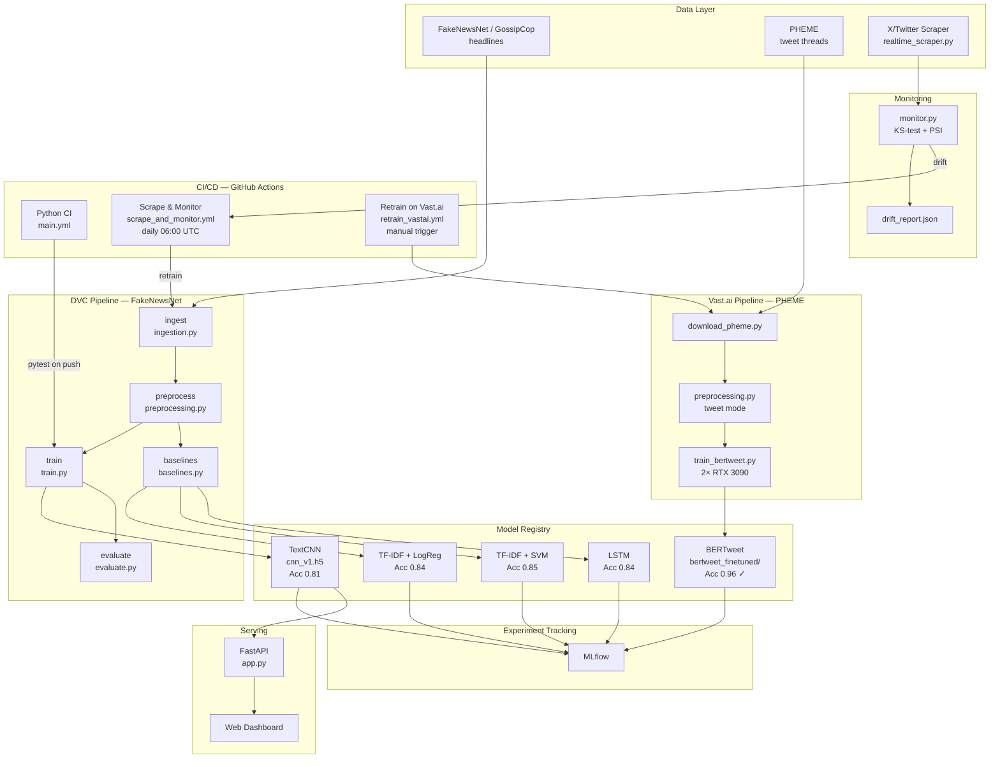
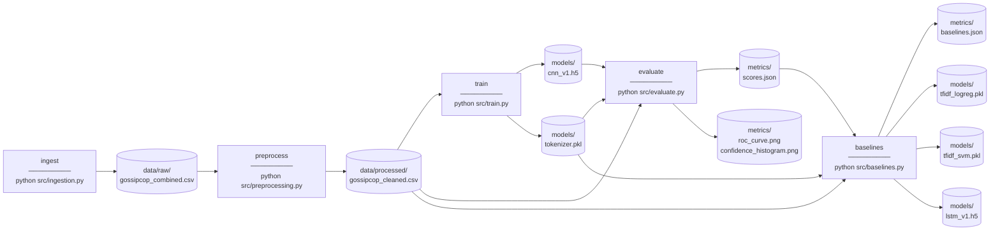
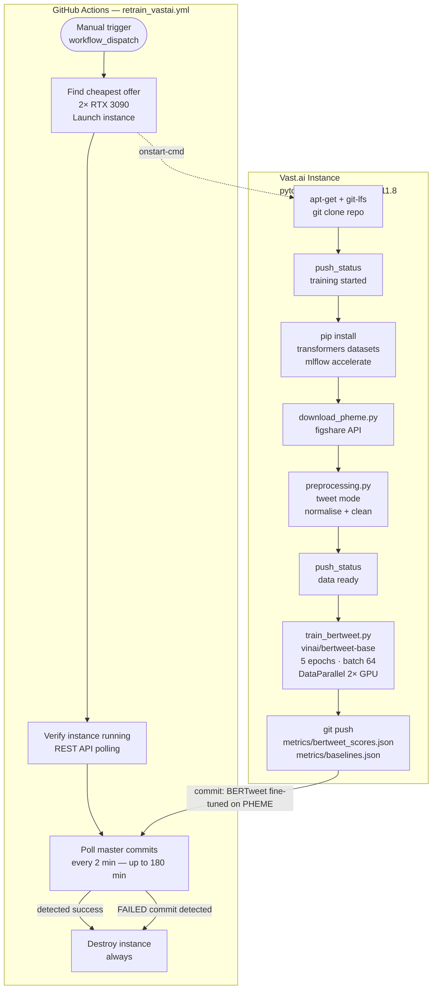
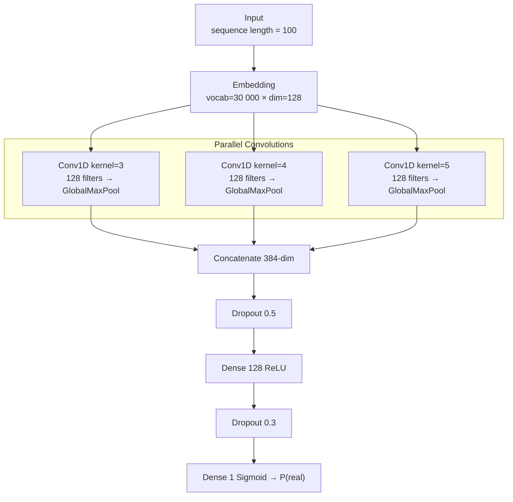
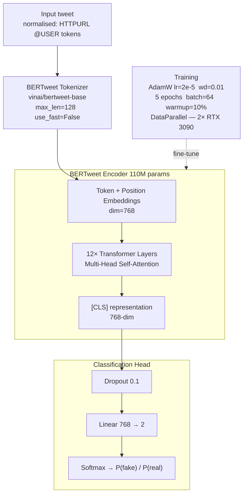
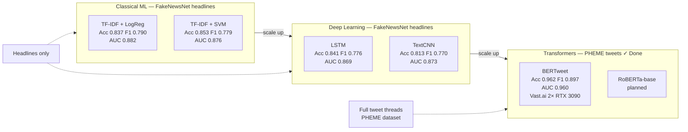
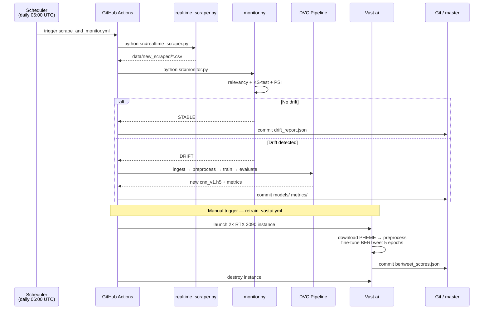
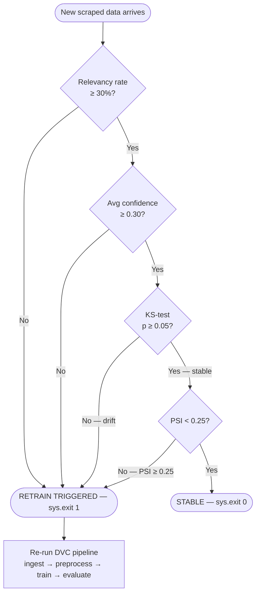
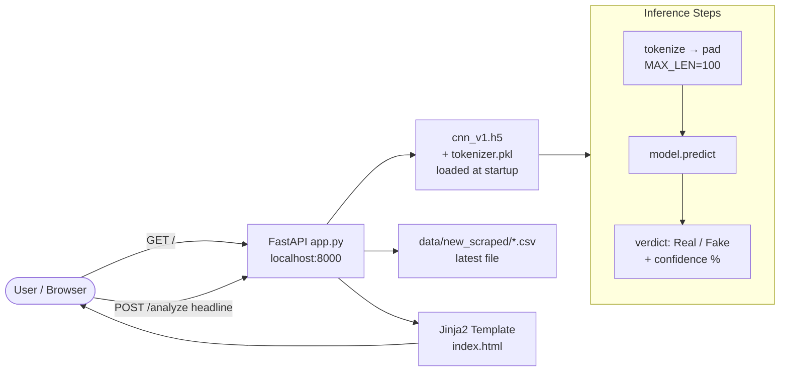

# Thesis Diagrams — Fake News Detection MLOps

---

## 1. Overall System Architecture

---

## 2. DVC Pipeline DAG — FakeNewsNet

---

## 3. Vast.ai BERTweet Training Pipeline

---

## 4. TextCNN Architecture

---

## 5. BERTweet Fine-Tuning Architecture

---

## 6. Model Comparison — All Results

---

## 7. Continuous Training Pipeline — GitHub Actions

---

## 8. Monitoring & Drift Detection Logic

---

## 9. Serving Architecture — FastAPI

