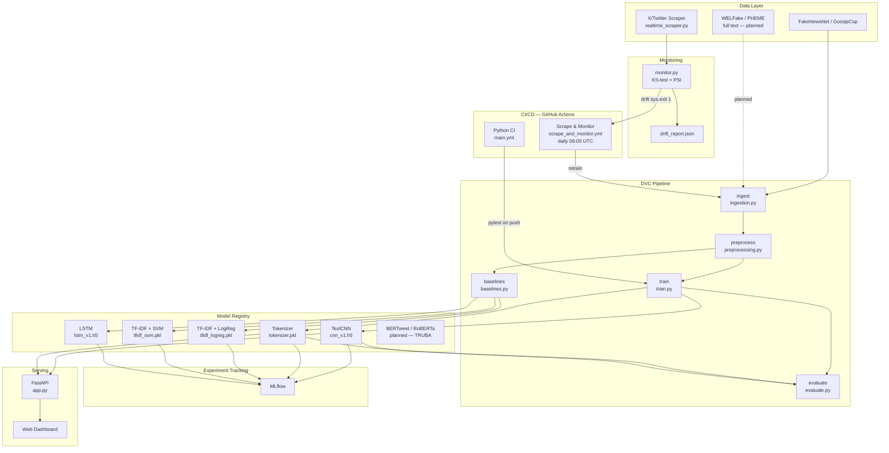
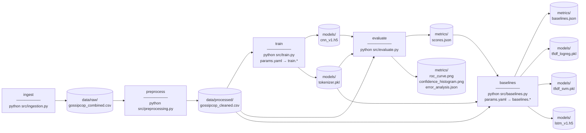
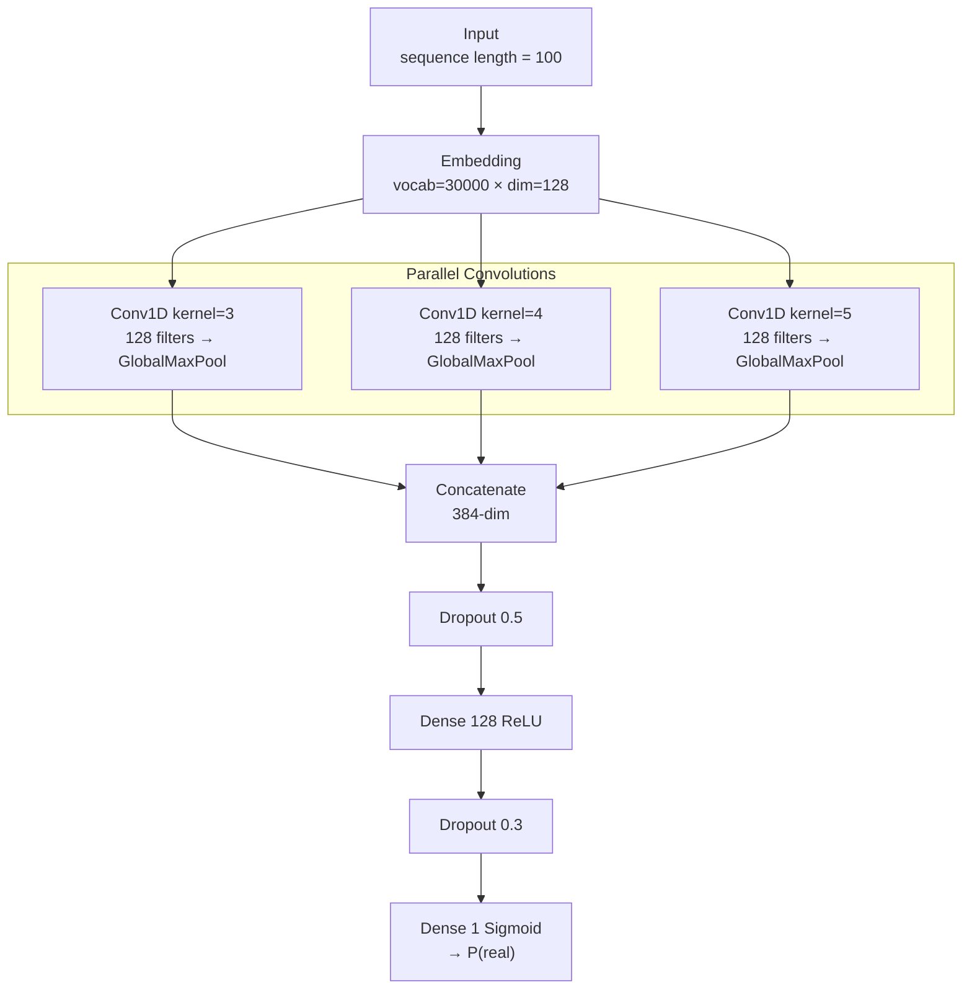
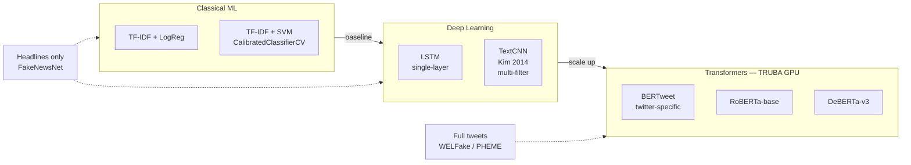
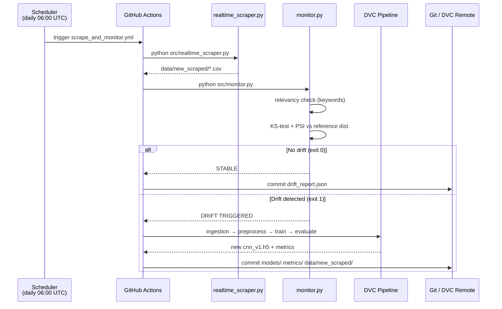
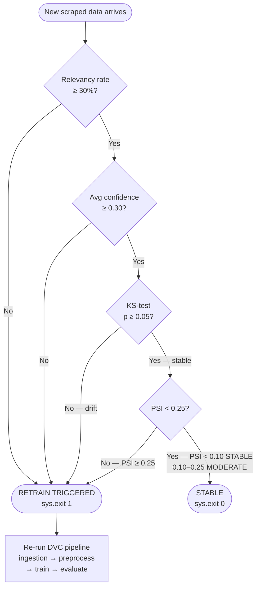
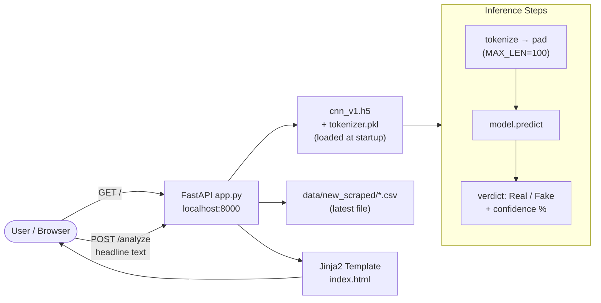
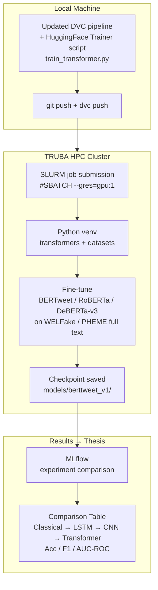

# Thesis Diagrams — Fake News Detection MLOps

---

## 1. Overall System Architecture

---

## 2. DVC Pipeline DAG

---

## 3. TextCNN Architecture

---

## 4. Model Comparison Hierarchy (Thesis Contribution)

---

## 5. Continuous Training (CT) Pipeline — GitHub Actions

---

## 6. Monitoring & Drift Detection Logic

---

## 7. Serving Architecture — FastAPI

---

## 8. Planned TRUBA Scale-Up Flow

